# Understand the current state of the art LLMs

> "You shall know a word by the company it keeps" - Linguist John Rupert Firth

Natural Language Processing (NLP) domain is currently the centre stage of monumental breakthroughs even though the research has been going on for half a decade now. Now is the best time to get started in the world of Machine Learning (ML)/Deep Learning (DL)/Artifical Intgelligence (AI) as it is akin to **Software 2.0** wherein more and more businesses, instituations and humanity as whole will increasingly use and interact with AI.

**How to represent  and sentences of a language in a way Computer can make sense of it?**

## Word Embeddings

Machine Learning has strong preference for structured fixed-length data. How to model the messiness and unstrutructed traits of textual data? 

### One-hot Encoding

One-hot encoding is a technique used in machine learning and data processing to convert categorical variables into a numerical format. It is commonly employed when dealing with categorical data in various tasks such as classification or neural network inputs, as most machine learning algorithms work with numerical data.

The process of one-hot encoding involves representing each word as a binary vector with all elements set to zero except for the index corresponding to the word, which is set to one. This way, each word becomes a unique vector, and the entire vocabulary of words is transformed into a matrix of binary values.

Let's go through an example to illustrate how one-hot encoding works:

Suppose we have a dataset containing information about the different colours: Alex, Ben, Charlie, Diana, and Eva. The possible favorite colors are "Red," "Blue," "Green," and "Yellow."

Here's the original dataset:

| Person  | Favorite Color |
|---------|----------------|
| Alex    | Blue           |
| Ben     | Green          |
| Charlie | Red            |
| Diana   | Blue           |
| Eva     | Yellow         |

To one-hot encode the "Favorite Color" column, we would follow these steps:

1. Identify the unique categories: In this case, the unique categories are "Red," "Blue," "Green," and "Yellow."

2. Create a binary vector for each category: We represent each category as a binary vector with the length equal to the number of unique categories. Since we have four unique colors, the binary vectors will have a length of four. Each vector will have all elements set to zero except for the element corresponding to the category, which will be set to one.

The binary vectors for each category are as follows:

- "Red" → [1, 0, 0, 0]
- "Blue" → [0, 1, 0, 0]
- "Green" → [0, 0, 1, 0]
- "Yellow" → [0, 0, 0, 1]

3. Replace the categorical values with the binary vectors: Now, we replace the original "Favorite Color" column with these one-hot encoded binary vectors.

The new dataset after one-hot encoding will look like this:

| Person  | Red | Blue | Green | Yellow |
|---------|-----|------|-------|--------|
| Alex    | 0   | 1    | 0     | 0      |
| Ben     | 0   | 0    | 1     | 0      |
| Charlie | 1   | 0    | 0     | 0      |
| Diana   | 0   | 1    | 0     | 0      |
| Eva     | 0   | 0    | 0     | 1      |

Each person's favorite color is now represented by a one-hot encoded binary vector, making it suitable for various machine learning algorithms.

#### Advantages of One-Hot Encoding:

1. **Simple Representation:** One-Hot Encoding is straightforward to implement and understand. It converts categorical data into a binary representation, where each category is represented by a unique binary vector.

2. **Preserves Categorical Information:** One-Hot Encoding preserves the categorical information without introducing any ordinal relationship between categories.

3. **Compatibility with Machine Learning Algorithms:** Many machine learning algorithms, especially those based on numerical calculations, require input data to be in numerical form. One-Hot Encoding is a convenient way to convert categorical data into a format suitable for these algorithms.

4. **Handling Non-Numeric Data:** One-Hot Encoding allows the inclusion of non-numeric data, such as text labels or categorical variables, in machine learning models. This enables the utilization of valuable information from such data in the modeling process.

5. **No Assumptions About Data Distribution:** One-Hot Encoding does not make any assumptions about the distribution of categorical data. It treats each category equally and independently, making it suitable for various data distributions.

6. **Interpretability:** The resulting binary vectors are easily interpretable, making it easier to inspect and understand the relationship between categories and the encoded features.

7. **No Magnitude Impact:** Since each category is represented by a binary vector, there is no magnitude impact on the encoding. All feature values are either 0 or 1, avoiding any magnitude-related biases.

8. **Handling Missing Data:** One-Hot Encoding can handle missing data gracefully. Missing values are simply represented as all 0s in the binary vectors, allowing algorithms to still process and learn from the available information.

9. **Useful for Categorical Features with Low Cardinality:** One-Hot Encoding is particularly useful for categorical features with low cardinality (a small number of unique categories), as it does not introduce significant dimensionality issues in such cases.

#### Limitations of One-Hot Encoding:

1. **High Dimensionality:** One-Hot Encoding creates a binary vector for each word in the dataset. As the number of unique word increases, the dimensionality of the encoded feature space also increases significantly. This can lead to a sparse and high-dimensional representation, making it computationally expensive and memory-intensive.

2. **No Semantic Information:** One-Hot Encoding treats all words as independent and unrelated. It does not capture any semantic similarity or hierarchical relationship between words. As a result, it may not be suitable for tasks that require understanding relationships or similarities between different words.

3. **Curse of Dimensionality:** The high dimensionality of One-Hot Encoding can lead to the curse of dimensionality, where the sparsity of the data negatively impacts the performance of machine learning algorithms, especially for small or limited datasets.


### Bag of words

Instead of a single index being non-zero in One-Hot Encoding, it has multiple non-zero values in the vector representation of a given sequence of words making up a sentence. it is called "Bag of words" due to the lack of preserving the ordering the words in a sentence making it an unordered collection of "bag" of words. It disregards grammar and ordering and is based on the frequency of each word in a given sentence/document. 

The BoW process involves the following steps:

1. **Tokenization:** The text is divided into individual words or tokens. Punctuation and special characters are usually removed, and all words are converted to lowercase to ensure consistency.

2. **Vocabulary Creation:** All unique words across the entire corpus (collection of documents) are collected to form a vocabulary. Each word is assigned a unique index in the vocabulary.

3. **Vectorization:** For each document, a feature vector is created. The length of this vector is equal to the size of the vocabulary, and each entry in the vector represents the frequency of the corresponding word in the document.

4. **Encoding:** The frequency of each word is recorded in the appropriate position of the document's feature vector, according to the word's index in the vocabulary.

Example of Bag of Words

Let's illustrate the Bag of Words technique with a simple example. Consider the following three short documents:

1. Document 1: "The cat chased the mouse."
2. Document 2: "The dog barked at the cat."
3. Document 3: "The mouse ran away from the cat and the dog."

Step 1: Tokenization and Vocabulary Creation

The vocabulary for these three documents will be:

| Index | Word   |
|-------|--------|
| 0     | the    |
| 1     | cat    |
| 2     | chased |
| 3     | mouse  |
| 4     | dog    |
| 5     | barked |
| 6     | at     |
| 7     | ran    |
| 8     | away   |
| 9     | from   |
| 10    | and    |

Step 2: Vectorization

Now, we create the feature vectors for each document based on the word frequencies:

Document 1: [2, 1, 1, 1, 0, 0, 0, 0, 0, 0, 0]
Document 2: [1, 1, 0, 0, 1, 1, 1, 0, 0, 0, 0]
Document 3: [3, 1, 0, 1, 1, 0, 0, 1, 1, 1, 1]

Step 3: Encoding

The vectors show the frequency of each word in the respective documents. For example, in Document 1, the word "the" appears twice, "cat" appears once, "chased" appears once, and so on.

#### Advantages over One-Hot Encoding:
1. **More informative:** In addition to word being present or not, it also encodes the frequency of it providing more information. This can be used for applications like semantic similairty wherein similar documents are likely to have similar word frequencies, which can be used in tasks like document clustering or recommendation systems. 

#### Limitations 
1. **Loss of Word Order:** BoW ignores the word order and the grammatical structure of the text, treating the text as an unordered collection of words. This loss of sequence information can result in the loss of crucial context and meaning, especially in tasks like sentiment analysis or natural language generation.

2. **Fixed Size Representation:** BoW generates a fixed-size vector for each document, where the dimensionality is determined by the size of the vocabulary. This can lead to a loss of information, as long documents may be truncated, and short documents may be padded, leading to unequal representation.

3. **Frequency-based Bias:** BoW relies heavily on the frequency of words in a document. This may cause common words (stopwords) that occur frequently in many documents to dominate the representation, while rare, yet important, words might get overshadowed.

4. **Out-of-Vocabulary Words:** Words that are not present in the vocabulary (words unseen during training) are usually ignored or replaced with a special token. This can result in losing valuable information from the input text, especially for domain-specific or rare terms.

5. **Sparsity:** BoW representation often results in sparse vectors, where most of the entries are zeros. Sparse data can be challenging to handle, especially for certain machine learning algorithms that assume dense feature vectors.


### TF-IDF (Term Frequency-Inverse Document Frequency)

TF-IDF is a popular technique used in natural language processing and information retrieval to represent the importance of words in a document within a collection of documents. It is an improvement over the Bag of Words (BoW) approach as it considers not only the frequency of words in a document but also their importance in the entire corpus.

#### How TF-IDF Works

The TF-IDF formula consists of two parts: Term Frequency (TF) and Inverse Document Frequency (IDF).

1. **Term Frequency (TF):** It measures the frequency of a word in a document. It is calculated as the ratio of the number of times a word appears in the document to the total number of words in that document. A higher TF value indicates that a word is more important in the document.

   TF = (Number of occurrences of a word in the document) / (Total number of words in the document)

2. **Inverse Document Frequency (IDF):** It measures the rarity of a word across all documents in the corpus. IDF is calculated as the logarithm of the ratio of the total number of documents to the number of documents containing the word. Words that appear in many documents will have a lower IDF value, making them less important.

   IDF = log((Total number of documents) / (Number of documents containing the word))

The TF-IDF score for a word in a document is obtained by multiplying its TF and IDF values.

Let's consider an example of using TF-IDF for retrieving relevant products to a given query in an e-commerce platform.

Suppose we have an e-commerce platform that sells electronic gadgets, and we want to use TF-IDF to retrieve relevant products for a user's search query.

Our product database contains the following three product descriptions:

1. Product 1: "High-quality wireless headphones with noise-canceling technology."
2. Product 2: "Powerful and compact Bluetooth speaker for immersive sound experience."
3. Product 3: "Smartphone with an advanced camera system and long-lasting battery."

Let's say a user enters the query: "wireless headphones sound quality"

Step 1: Preprocessing and Calculating Term Frequencies

We first preprocess the query and product descriptions by tokenizing the text, converting everything to lowercase, and removing any stopwords.

The term frequencies (TF) for the query are as follows:

| Term         | TF(query, Product 1) | TF(query, Product 2) | TF(query, Product 3) |
|--------------|-------------------|--------------|-------------------|
| wireless     | 1                 | 0                 | 0                 |
| headphones   | 1                 | 0                 | 0                 |
| sound        | 0                 | 1                 | 0                 |
| quality      | 1                 | 0                 | 0                 |

Step 2: Calculating Inverse Document Frequencies (IDF)

Next, we calculate the inverse document frequency (IDF) for each term in the query. In this example, since we only have three products, the IDF values for all terms will be the same.

| Term         | IDF("term")      |
|--------------|------------------|
| wireless     | log(3/1) ≈ 0.585 |
| headphones   | log(3/1) ≈ 0.585 |
| sound        | log(3/1) ≈ 0.585 |
| quality      | log(3/1) ≈ 0.585 |

Step 3: Calculate TF-IDF Scores

We calculate the TF-IDF scores for each product based on the query:

| Product      | TF-IDF(query, Product) |
|--------------|----------------------|
| Product 1    | 1 * 0.585 + 1 * 0.585 + 0 * 0.585 + 1 * 0.585 = 1.755 |
| Product 2    | 0 * 0.585 + 0 * 0.585 + 1 * 0.585 + 0 * 0.585 = 0.585 |
| Product 3    | 0 * 0.585 + 0 * 0.585 + 0 * 0.585 + 0 * 0.585 = 0 |

Step 4: Ranking the Products

Based on the TF-IDF scores, we can rank the products in descending order of relevance to the user's query:

1. Product 1: "High-quality wireless headphones with noise-canceling technology." (TF-IDF score: 1.755)
2. Product 2: "Powerful and compact Bluetooth speaker for immersive sound experience." (TF-IDF score: 0.585)
3. Product 3: "Smartphone with an advanced camera system and long-lasting battery." (TF-IDF score: 0)

This example demonstrates how TF-IDF can be used to retrieve relevant products in an e-commerce platform based on a user's search query. The TF-IDF scores help in ranking the products in order of their relevance, making it easier for users to find the most suitable products for their needs.

#### Advantages over Bag of Words:

1. **Term Importance:** TF-IDF considers not only the term frequency in a document (TF) but also the rarity of the term across the entire document collection (IDF). This means that common words that appear frequently in many documents will have a lower TF-IDF score, reducing their impact on the representation. Rare and important words that appear in specific documents will have higher TF-IDF scores, making them more influential in the analysis. This naturally handles stopwords (common words like "the," "and," "is," etc.), which typically have little semantic value

2. **Document Relevance**: TF-IDF helps in identifying relevant documents for a given query. By focusing on important terms and discounting common words, TF-IDF gives higher scores to documents that contain rare and relevant words related to the query. This makes them great for Semantic Similarity. Specifically useful for straighforward queries such as books/novels wherein customers directly just type the exact name of books such as "Harry Potter and the Goblet of Fire" etc. Here, syntactic match is enough.  

#### Limitations

1. **Absence of Semantic Understanding:** TF-IDF treats each term independently and does not capture semantic relationships between words. It cannot understand the meaning or context of words, making it less suitable for tasks that require a deeper understanding of language semantics. For example, it fails to capture that "Geyser" and "Water Heater" mean the same thing. It also fails to capture that "apple" has different meaning in "She ate a juicy red apple." (Fruit) when compared to "I bought a new Apple laptop." (Brand of technology products), i.e., failing to capture contextual representation of words.

2. **Scalability:** For very large document collections, computing the TF-IDF representation for each document can become computationally expensive and memory-intensive. Additionally, maintaining a large vocabulary might also pose challenges.

### Word2vec

To address the aforementioned limitations, word embeddings offer an efficient and compact(dense) way of representing words, ensuring that words with similar meanings have similar encodings. Word Embedding is a vector containing floating point values and hence the term "Dense Representation". The values for the embedding are trainable parameters which are learned similarly
to a model learning the weights for a dense layer. The dimensionality of the word representations is typically much smaller than the number of words in the dictionary. 

One of the foundational work in this regard is the `word2vec`. It proposes 2 methods to learn word embeddings:
1. Continuous Bag of Words: Predicts the current word based on the context 
2. Continuous Skip-Gram: Predicts surrounding words given the current word

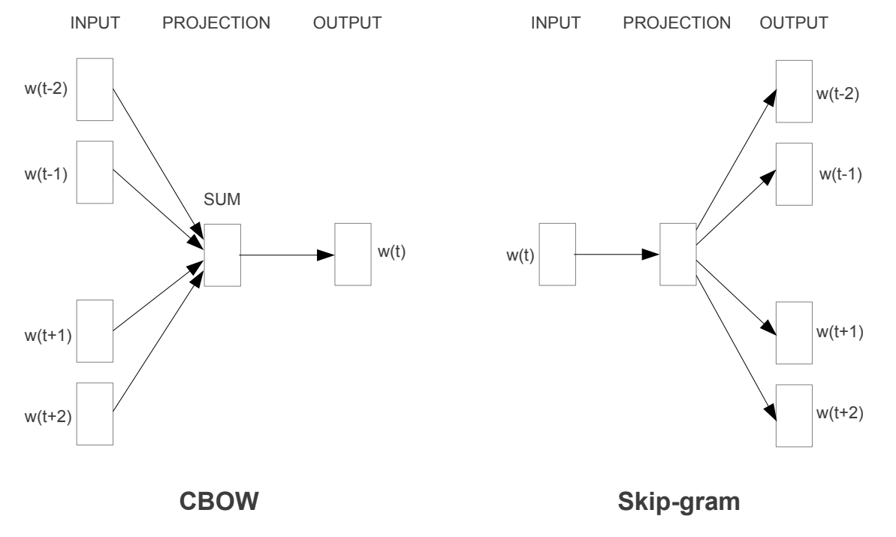
[Source [Efficient Estimation of Word Representations in Vector Space](https://arxiv.org/pdf/1301.3781.pdf)]

Below is an example for Skip-Gram model:

Let's consider a small corpus with the following sentence:

"Learning deep learning is essential for artificial intelligence."

Step 1: Prepare Training Data

To train the skip-gram model, we first create training pairs of target and context words. We define a context window size (e.g., 2), which determines how many words on either side of the target word will be considered as context words.

For the sentence above, with a context window size of 2, the training pairs would be:

- (Learning, deep)
- (Learning, learning)
- (deep, Learning)
- (deep, learning)
- (deep, is)
- (learning, Learning)
- (learning, deep)
- (learning, is)
- (learning, essential)
- (is, deep)
- (is, learning)
- (is, essential)
- (essential, learning)
- (essential, is)
- (artificial, is)
- (artificial, essential)
- (intelligence, essential)
- (intelligence, artificial)

Step 2: Train the Skip-Gram Model

The skip-gram model takes these training pairs as input and tries to learn word embeddings by optimizing its parameters to predict the context words given the target word. The goal is to maximize the probability of the context words given the target word.

Step 3: Word Embeddings

Once the skip-gram model is trained, it will generate word embeddings for each word in the vocabulary. These embeddings are dense and lower-dimensional representations of words, capturing the semantic relationships between words based on their co-occurrence patterns in the training data.

The resulting word embeddings might look like:

| Word       | Embedding Vector            |
|------------|----------------------------|
| Learning   | [0.2, 0.5, -0.1, ...]       |
| deep       | [-0.3, 0.7, 0.4, ...]       |
| learning   | [0.1, -0.6, 0.8, ...]       |
| is         | [0.5, 0.3, -0.2, ...]       |
| essential  | [-0.4, 0.2, 0.6, ...]       |
| artificial | [0.7, 0.1, -0.5, ...]       |
| intelligence | [-0.2, -0.3, 0.9, ...]    |
| ...        | ...                        |

Step 4: Word Similarity

The learned word embeddings capture semantic similarities between words. Words with similar meanings or contexts will have similar embeddings. For example, the embeddings for "Learning" and "learning" are likely to be close to each other since they appear in similar contexts in the training data.

With these word embeddings, we can perform various NLP tasks, such as word semantic similarity, document classification, and even text generation, by leveraging the semantic relationships captured in the dense word embeddings.

Word embeddings have interesting properties in terms of geometrical relationships. For example, in the below image we see that linear relationships between semantically similar embeddings, i.e., `vector(Japan)−vector(Tokyo)+vector(Russia) ~ vector(Moscow)`


[Source [Embeddings: Translating to a Lower-Dimensional Space](https://developers.google.com/machine-learning/crash-course/embeddings/translating-to-a-lower-dimensional-space)]

#### Limitations:

1. **Absence of Context Understanding:** Since, the word embeddings are static, it lacks the ability to model semantic relationship between words based on context. Again, it fails to capture that "apple" has different meaning in "She ate a juicy red apple." (Fruit) when compared to "I bought a new Apple laptop." (Brand of technology products).

## Encoder-Decoder Models

Let deep dive into the problem of Machine Translation. i.e., translating text from one language to another, e.g., translating Hindi to English. As the input length can be differnt than the ouput length, it demands for a architecture which can handle this. The encoder-decoder architecture is devised for this purpose. Encoder converts the input sentence into fixed representation and decoder takes this fixed representation and converts it into target sentence sequentially. Below is a diagram showing the process.


[Source [cs224n 2022](https://web.stanford.edu/class/cs224n/slides/cs224n-2022-lecture05-rnnlm.pdf)]

To encode and decode, we need to capture the semantic and contextual representation of words. One way to capture semantic and contextual relationship is to condition the prediction of next word based on all the words generated so far. This results in a recurrence relationship which is nicely captured by Recurrent neural Networks (RNNs).

### Recurrrent Neural Networks (RNNs)

Recurrent Neural Networks (RNNs) are a type of neural network designed to process sequential data, such as time series or natural language. They have feedback connections that allow them to maintain a hidden state, enabling them to retain information about past inputs. This hidden state serves as a memory, allowing RNNs to consider the context of each input in relation to previous inputs. RNNs are particularly effective for tasks involving sequential patterns, like language modeling, machine translation, and speech recognition. 


[Source [cs224n 2022](https://web.stanford.edu/class/cs224n/slides/cs224n-2022-lecture05-rnnlm.pdf)]

#### Limitations:

1. **Exploding or Vanishing Gradients:** They suffer from vanishing or exploding gradient problems, which can make it challenging for them to capture long-range dependencies effectively. It is also due to Backpropagation through time.
2. **Recurrent computation is slow:** Doesn't allow for parallelization of operations leading to suboptimal usage of hardware resources.
3. **Emprically, RNNs underperform to handle long-term dependencies**

### Long Short-Term Memory Models (LSTMs)

Long Short Term Memory networks – usually just called “LSTMs” – are a special kind of RNN, capable of learning long-term dependencies. LSTMs are explicitly designed to avoid the long-term dependency problem. Remembering information for long periods of time is practically their default behavior, not something they struggle to learn!

Instead of just the hidden state, they have an additional state called cell state which makes it easier for information to flow through unchanged, thereby allowing to handle long-term dependencies. It has a "forget gate layer", "input gate layer" and "output gate layer" controlling what information to forget and update and what to ouput as part of next hidden state. 
Below is a diagram of the LSTM architecture:


[Source [Understanding LSTM Networks](https://colah.github.io/posts/2015-08-Understanding-LSTMs/)]

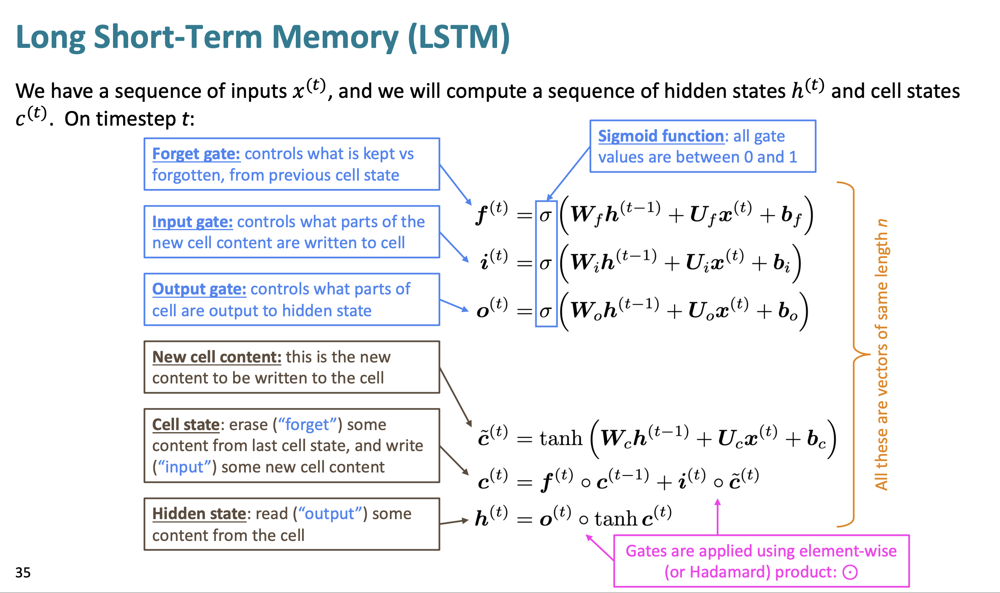
[Source [cs224n 2022](https://web.stanford.edu/class/cs224n/slides/cs224n-2022-lecture06-fancy-rnn.pdf)]

#### Limitations of Encoder-Decoder models we have seen so far

Encoder-Decoder models help in Many-to-Many foramt problems but have their own limitations. 
1. **Information Bottleneck Problem:** Compressing whole information of a given sentence into fixed-size vector often leads in loss of valuable information. 
2. **Vanishing Gradients:** Backpropagation through time leads to disappearance of information as it backpropagates. This is because gradients with less than 1 at each steps leading to smaller and smaler and smaller gradients vanishing to 0.

### LSTMs with Attention

Now, let's take inspiration from Human's attention span. **Our brain focuses on a limited part of the whole information. Attention is a mechanism that enables us to selectively focus on a specific part of the whole information as required by the task.** Can this be extended to Deep Learning models? Yes.

Attention techniques allows models to retain complete information from the source sentence without compression. Thereby, **solving the information bottleneck**. It enables the Decoder to selectively focus on particular parts of the source sentence while sequentially generating the output, thereby **being more "human-like" and "somewhat explainable"**. it also **solves the vanishing gradient problem** by providing shorcut for gradients to flow to faraway state. Below is a diagram showing the architecture of using LSTMs with Attention.


#### Limitations of RNNs/LSTMs
1. **Allows only Sequential computations within a sequence:** This leads to drastic under-utilization of compute resources such as GPUs/TPUs which are meant for parallel workloads.
2. **O(Seq Len) to model dependdencies:** Sequential Structure- takes linear time for capturing long-term
dependencies. E.g. O(n) operations where n is the sequence length.
3. **Complicated learning process:** First word is over-processed and last word is under-processed
which leads to complicated learning process.

## Convolutional Seq2Seq with Attention

Address the above limitations. CNNs **allows for for parallel computations within sequence too**. **Hierarchical Structure** provides shorter path for capturing long-range dependencies. E.g. **O(n/k) operations where n is the sequence length and k is the kernel size**. Constant number of kernels and non-linearities applied to the input which **eases learning process**.

We had leveraged ConvSeq2Seq by Gehring et al. for NLG task when Transformers were still niche and got better results than RNNs while being **21X** faster to train.

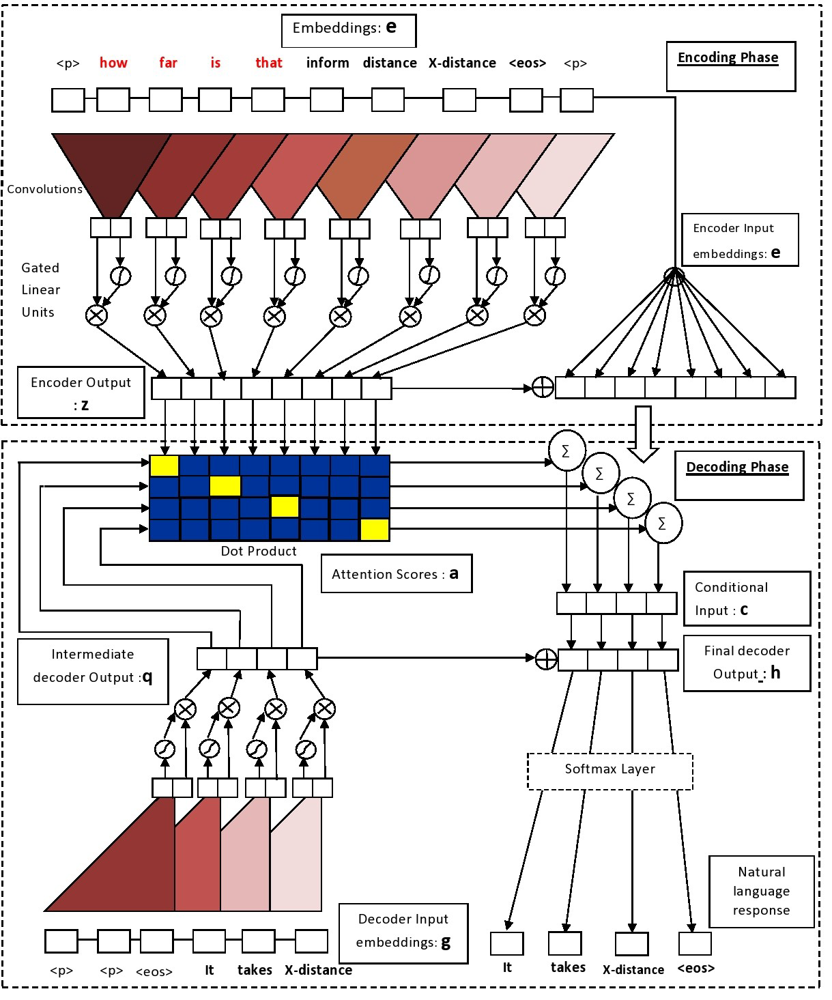
[Source [Mangrulkar et al.](https://aclanthology.org/W18-5020.pdf) [Gehring et al.](https://arxiv.org/pdf/1705.03122.pdf)]

#### Limitations
1. **Creates representations for fixed context sizes** Solution: Stacking of Convolutional layers/blocks

### Inflection Point

**What if Attention is all we need?**

## Transformer


### Attention is all you Need

Research Paper: [Attention Is All You Need](https://arxiv.org/pdf/1706.03762.pdf)

Address the above limitations of RNNs/LSTMs/CNNs. In Attetnion, each "word" interacts with each other, so 
maximum interaction distance: **O(1)**. Attention can be **fully computed in parallel** and there have been great breakthroughs in computing the attention weights faster with the most noticeable one in the recent times being **Flash Attention**. Constant number of operations and non-linearities applied to the input which **eases learning process**. The QKV architecture is meant to **encapsulate contextual representation of words**, i.e., to enable the model to capture that "apple" has different meaning in "She ate a juicy red apple." (Fruit) when compared to "I bought a new Apple laptop." (Brand of technology products).

SoTA results everywhere using Transformers! 🤯

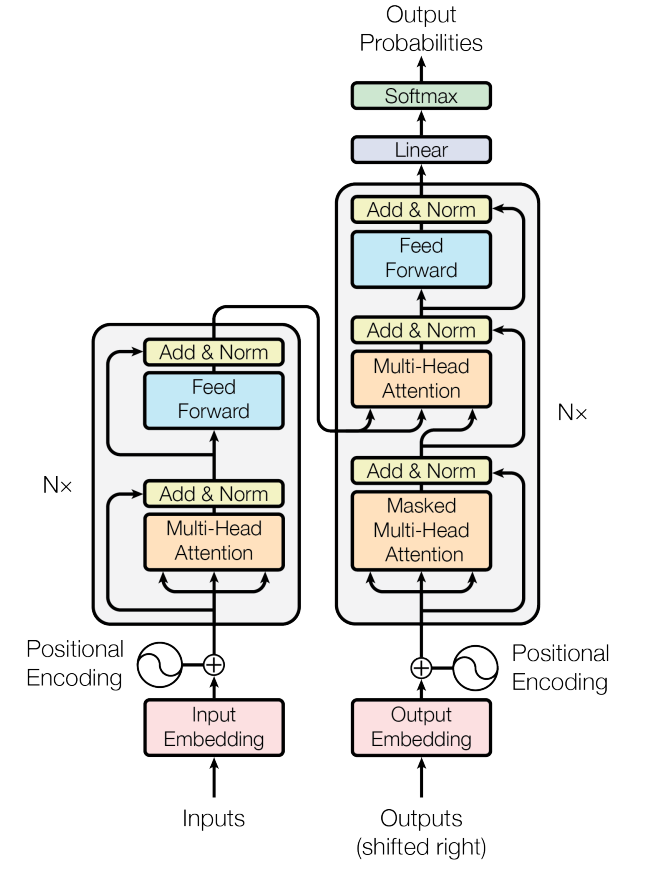
[Source [Attention Is All You Need](https://arxiv.org/pdf/1706.03762.pdf)]


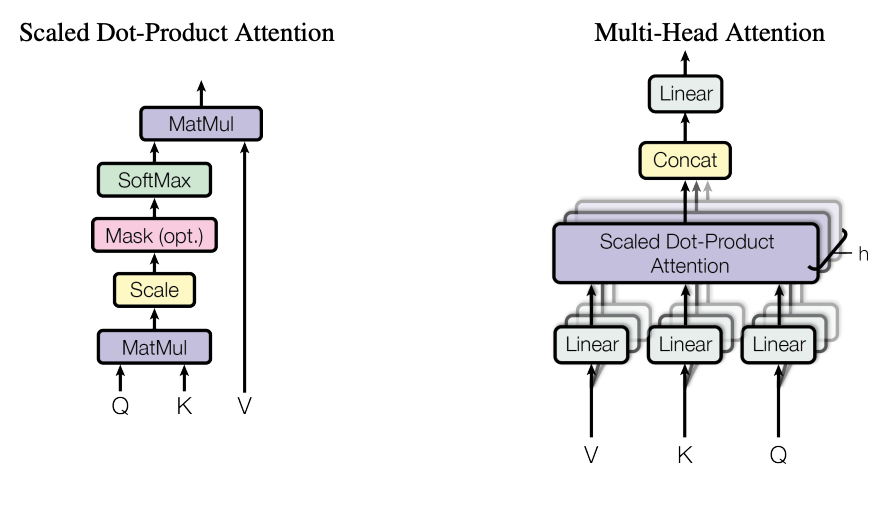
[Source [Attention Is All You Need](https://arxiv.org/pdf/1706.03762.pdf)]

#### Attetion Mechanism

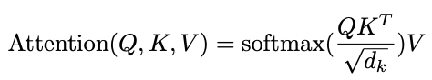
[Source [Attention Is All You Need](https://arxiv.org/pdf/1706.03762.pdf)]

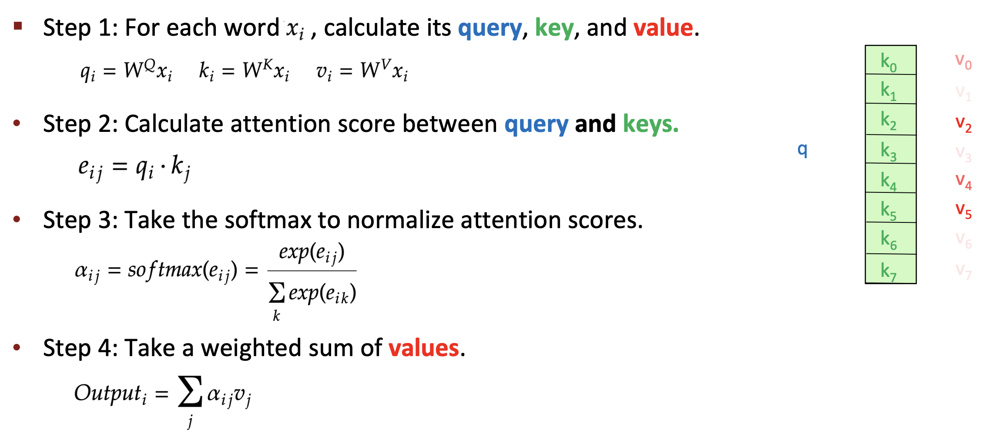
[[cs224n 2022](https://web.stanford.edu/class/cs224n/slides/cs224n-2022-lecture09-transformers.pdf)]

Below is a visulaization of the attention weights. We can see that word "it" is correctly attending to the word "animal". 

[Source [The Illustrated Transformer](https://jalammar.github.io/illustrated-transformer/)]

### Bi-Directional Encoder Representation From Transformers (BERT)

Research Paper: [BERT: Pre-training of Deep Bidirectional Transformers for Language Understanding](https://arxiv.org/abs/1810.04805)

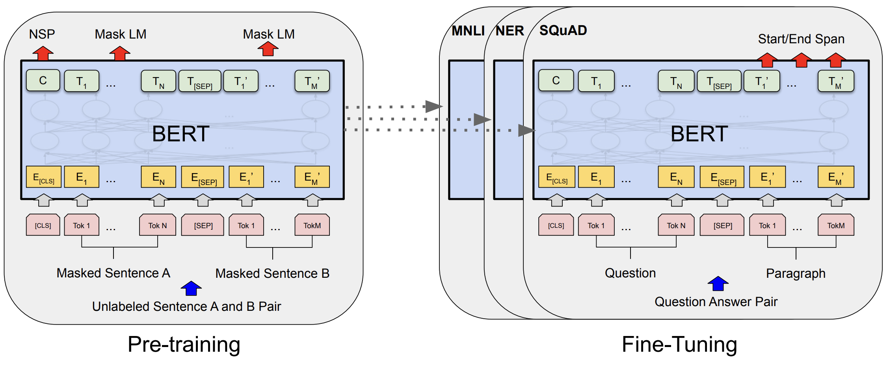

#### Overall Idea and Training Objective

**Idea**: Deep bidirectional model is strictly more powerful than either a left-to-right
model or the shallow concatenation of a left-to-right and a right-to-left model.

**Masked Language Modeling:** Masked Language Modeling (MLM) is a language modeling task where certain words or tokens in a sentence are randomly masked. The model's objective is to predict the original masked words based on the context provided by the other tokens. This task helps pre-trained language models (e.g., BERT) learn bidirectional representations and understand the relationships between words in a sentence, making them effective for various natural language processing tasks. Applied during pre-training.

**Next Sentence Prediction:** To incorporate sentence relationship which are necessary for many downstream tasks, a binary classification task to predict if the second sentence is continuation of first sentence is added. Applied during pre-training.

**Supervised Fine-Tuning on Dwonstream tasks:** This part aimed at maximising the likelihood of observing label y, given features or tokens x_1,…,x_n. Applied on the downsteam tasks.

#### Model Architecture

Type: Encoder based model with Multi-Head Self-Attention
Layers: 12-24 layers
Tokenizer: WordPiece embedding with 30,000 vocab size
Learned Positional Embeddings with max sequence length 512  
`bert-base`: (Layers=12, Embedding_dim=768, Num_Attn_Heads=12, Total Parameters=110M) and 
`bert-large`: (Layers=24, Embedding_dim=1024, Num_Attn_Heads=16, Total Parameters=340M).

#### Datasets Used
3.3 Billion word corpus: BooksCorpus : 800M words + English Wikipedia: 2.5B words

#### Implementation Details
Training of BERTBASE was performed on 4 Cloud TPUs in Pod configuration (16 TPU chips
total).13 Training of BERTLARGE was performed on 16 Cloud TPUs (64 TPU chips total). Each pre-training took 4 days to complete.


### Generative Pre-Trained Models (GPT) 

Research Paper: [Improving Language Understanding
by Generative Pre-Training](https://cdn.openai.com/research-covers/language-unsupervised/language_understanding_paper.pdf)

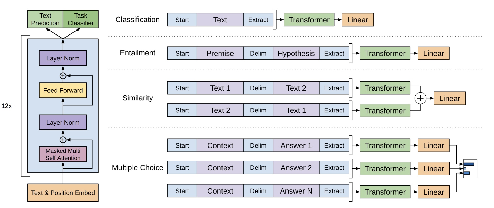

#### Overall Idea and Training Objective

**Idea**: SoTA results with **generative pre-training** of a language model
on a diverse corpus of unlabeled text, followed by **discriminative fine-tuning** on each
specific task

**Causal Language Modeling:** Causal Language Modeling is a language modeling task where the model is trained to predict the next word in a sequence based on the preceding words. It only uses information from the past context and does not have access to future words. This makes it suitable for tasks that require generating sequences one step at a time, such as text generation.

**Supervised Fine-Tuning on Dwonstream tasks:** This part aimed at maximising the likelihood of observing label y, given features or tokens x_1,…,x_n. Applied on the downsteam tasks. Iincluding language modeling as an auxiliary objective to the fine-tuning helped learning by (a) improving generalization of the supervised model, and (b) accelerating convergence. 

#### Model Architecture
Type: Decoder based model with **Masked** Multi-Head Self-Attention
Layers: 12 layers
Tokenizer:  bytepair encoding (BPE) embedding with 40,000 vocab size
Learned Positional Embeddings with max sequence length 512  
Parameters: 110M

#### Datasets Used
BooksCorpus : 800M words


### GPT-2

Research Paper: [Language Models are Unsupervised Multitask Learners](https://cdn.openai.com/better-language-models/language_models_are_unsupervised_multitask_learners.pdf)

#### Overall Idea and Training Objective

**Idea**: **Larger dataset** + **Larger Model** results in more performant model. Ability to learn multiple downstream tasks as part of pre-training with scale. Can schieve SoTA results in a **Zero-Shot** Setting.

Learning objectives are same as above.

Prompting method for **Zero-Shot** evaluation:
Reading Comprehension: "{document} Q:{Q1} A:{A1} ... Q:{Q} A:"
Translation: "english {sentence} = french "
Summarization: "{context} TL;DR:"
Question Answering (They use Few-Shot): "{question1} {answer1} ... {question} "


#### Model Architecture
Type: Decoder based model with **Masked** Multi-Head Self-Attention
Layers: 48 layers
Tokenizer:  Byte-level Bytepair encoding (BPE) embedding with 50,257 vocab size
Learned Positional Embeddings with max sequence length 1024  
Parameters: 1.5B params

#### Datasets Used
Proprietary **WebText** dataset with 40GB of text data from over 8 million documents scraped from Reddit.

### GPT-3

Research Paper: [Language Models are Few-Shot Learners](https://arxiv.org/abs/2005.14165)

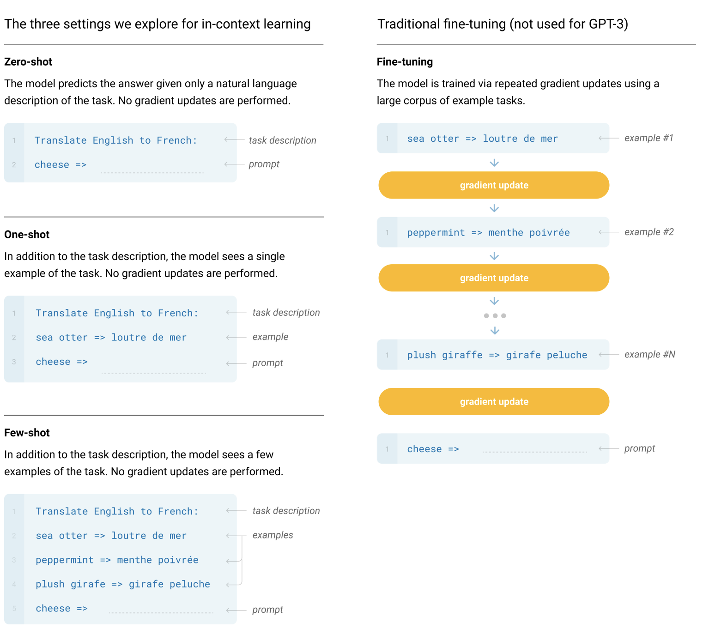

#### Overall Idea and Training Objective

**Idea**: **Larger dataset** + **Larger Model** results in more performant model. Scaling to **175B** params 🤯. Ability to learn multiple downstream tasks as part of pre-training with scale. Can achieves SoTA results in a **Few-Shot** Setting.

**In-context learning:** LLMs develop a broad set of skills and pattern recognition abilities at training time, and then uses those abilities at inference time to rapidly adapt to or recognize the desired task. This is what we call “in-context learning”, using the text input of a pretrained language model as a form of task specification: **the model is conditioned on a natural language instruction and/or a few demonstrations (Few-Shot) of the task and is then expected to complete further instances of the task simply by predicting what comes next.**

Example of Few-Shot:

```
I am a highly intelligent question answering bot. If you ask me a question that is present in the product title, bullet points or description, I will give you the answer. If you ask me a question that is nonsense, trickery, or has no clear answer, I will respond with "Unknown".

Product Title: OnePlus 9R 5G (Carbon Black, 8GB RAM, 128GB Storage)
About this item
1. Qualcomm Snapdragon 870 5G with upgraded Qualcomm Kryo 585 CPU that performs intense mobile computing at up to 3.2 GHz and also comes with an ultra-fast Qualcomm Adreno 650 GPU for superb on-device experiences
2. Loaded with Quad rear camera module that features a 48 MP Main camera, 16 MP Ultra Wide angle Camera, 5 MP Macro camera and a 2 MP Monochrome camera. The device also comes with a 16 MP front Camera
3. 6.55 Inches Fluid AMOLED display with 120 Hz of Refresh rate
A Powerful 4500 mAh with 65 Watt Warp charging capability
4. Oxygen OS based on Andriod 11
5. Hands-Free access to Alexa: Alexa on your phone lets you make phone calls, open apps, control smart home devices, access the library of Alexa skills, and more using just your voice while on-the-go. Download the Alexa app and complete hands-free setup to get started. Just ask - and Alexa will respond instantly
Product Description: 
6. What's in the box: OnePlus 9R 5G, Power Adapter, Cable, Quick Guide, Welcome Leter, Important Notes, Logo Stickers, Transparent Case, Protector, Card Pin

Q: What is the battery capacity?
A: 4500 mah

Q: What is version of the OS? 
A: 
```
The completion:
```
Oxygen OS based on Android 11
```

Another Example:
```
Shorten the product title while keeping the  important attributes.

Title: Triumph Plain Dyed Color Cycling Jersey for Men Half Sleeve Regular Fit Full Zipper Mountain Biking Tshirt Men's Solid Color Bicycle Jerseys Quick Dry Cycling Wear
tl;dr:  Triumph Cycling Jersey for Men

Title: CHKOKKO Men's Solid Cotton Round Neck Regular Fit Half Sleeves T-Shirt. Quick dry and easy wash, durable material.
tl;dr:    CHKOKKO Men's Solid Cotton T-Shirt

Title: Fashion SAY Jaipuri Rajasthani Rayon Straight Kurti, Plazzo and Dupatta Set for Women & Girls Dress (Navy Blue)-P (Select Size Below for Each Product Descriptions)
tl;dr: 
```
The completion:
```
SAY Jaipuri Rajasthani Rayon Kurti, Plazzo and Dupatta Set for Women & Girls
```

#### Model Architecture
Similar to GPT-2 but scaled to 175B parameters. 
`GPT-3 175B`: (Layers=96, Embedding_dim=12288, Num_Attn_Heads=96, Total Parameters=175B).

#### Datasets Used
5 sources namely Common Crawl, WebText2, Books1, Books2 and Wikipedia. Sampling in order to oversample quality datasets. Trained for 300B tokens. 

#### Implementation Details
V100 GPU’s on part of a high-bandwidth cluster provided by Microsoft. mixture
of model parallelism within each matrix multiply (Tensor Parallelism) and model parallelism (ModelParallelism) across the layers of the network to fit model on GPUs.

### Text-To-Text Transfer Transformer (T5)

Research Paper: [Exploring the Limits of Transfer Learning with a Unified Text-to-Text Transformer](https://arxiv.org/abs/1910.10683)


#### Overall Idea and Training Objective

**Idea**: Shared text2text framework, wherein all tasks are converted to have textual labels. 

Masked Span Corruption Modeling: Masked Span Corruption Modeling is a variant of pre-training for language models where continuous spans of text are randomly masked instead of individual tokens. These masked spans include multiple consecutive tokens, allowing the model to understand longer contextual dependencies. By predicting the missing spans, the language model learns to capture more extensive linguistic relationships and improve its ability to generate coherent and contextually relevant text.

#### Model Architecture
Type: Encoder-Decoder based model with **Masked** Multi-Head Self-Attention
Layers: 24 layers
Tokenizer:  SentencePiece embedding with 32,000 vocab size
Relative Positional Embeddings with max sequence length 512  
Parameters: 11B

#### Datasets Used
Colossal Clean Crawled Corpus (C4) (750 GB)

## Types of LLMs

### Continuing the Text

All the GPT models we looked at so far with just the Causal Language Modeling (CLM) training objective.

### Instruction Aligned

Research paper and Technical Reports:

1. [Training language models to follow instructions
with human feedback](https://arxiv.org/pdf/2203.02155.pdf)

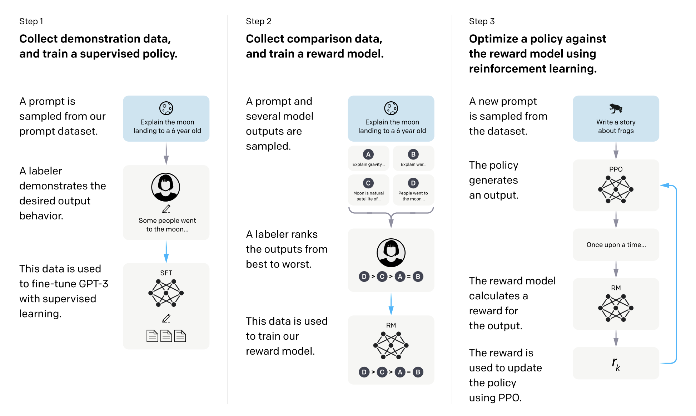

#### Overall Idea and Training Objective

**Idea**: Instead of automated metrics like `BLUE`/`ROUGE`/`Accuracy`, what if we use human feedback itself to improve the LLMs to follow instructions and **align** with human incentives of making the model **Helpful, Harmless and Honest**.

Nice Gist expalin the RLHF process: [Reinforcement Learning from Human Feedback (RLHF) - a simplified explanation](https://gist.github.com/JoaoLages/c6f2dfd13d2484aa8bb0b2d567fbf093)

## Additional References
- [Multimodal Deep Learning](https://arxiv.org/pdf/2301.04856.pdf)