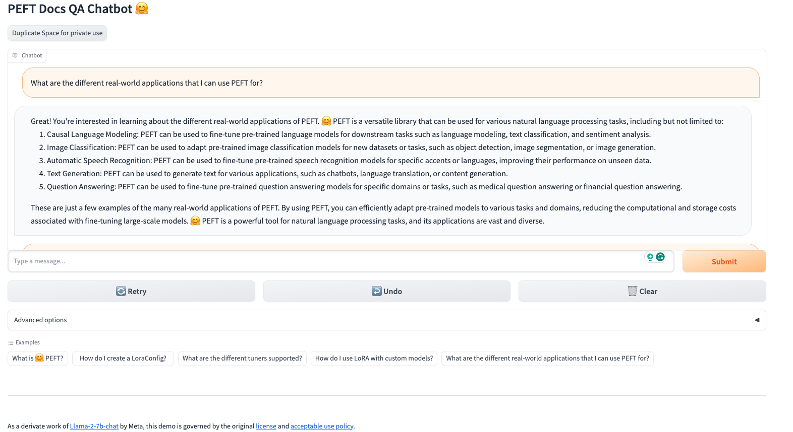

# LLM Tools and Frameworks

## Building Retrieval Augmented Generation (RAG) based Question-Answering (QA) Chatbot on Private Knowledge Base

We will build the QA Chatbot from scratch to know what is required to design and build for QA based Chatbots similar to how we have been looking into pretraining, finetuning and PEFT instead of just using the APIs for LLMs. Then we will see how Langchain makes things easy.

Steps involved in creating a QA Chatbot:

### Scraping the website
We are considering the [PEFT documentation](https://huggingface.co/docs/peft/index) as an example here. 
1. Go to [doc_scraper](../6_Module/question_answering_gradio_app/doc_scraper/) and see how the code we generated using ChatGPT is working.

Go to [doc_scraper](../6_Module/question_answering_gradio_app/doc_scraper/) and run:
```
scrapy crawl hf_docs
```

### Chunking the text
1. Go to [chunking](../6_Module/question_answering_gradio_app/chunking/) and see the simple chunking algorithm using chunk length and chunk overlap.

Go to [question_answering_gradio_app](../6_Module/question_answering_gradio_app/) and run:
```
python chunking/chunking.py --chunk_length=448 --chunk_overlap=128 --folder_path "doc_scraper/output" --output_file "chunked_data.parquet"
```

### Indexing
1. Go to [indexing](../6_Module/question_answering_gradio_app/indexing/) and see how to index the chunks that we have created using `hnswlib` and one of the best open source `Bi-Encoder` model as per [MTEB Benchmark](https://huggingface.co/spaces/mteb/leaderboard) [intfloat/e5-large-v2](https://huggingface.co/intfloat/e5-large-v2).

Go to [question_answering_gradio_app](../6_Module/question_answering_gradio_app/) and run:
```
python indexing/create_index.py --input_file="chunked_data.parquet" --output_file="search_index.bin"
```

### Retrieval and Re-ranking

### Retrieval
We will use [intfloat/e5-large-v2](https://huggingface.co/intfloat/e5-large-v2) for retrieving top 10 relevant chunks to the user query based on cosine similarity between query embedding and the chunks embeddings. 

### Re-ranking
We will use open source model [cross-encoder/ms-marco-MiniLM-L-12-v2](https://huggingface.co/cross-encoder/ms-marco-MiniLM-L-12-v2) `Cross-Encoder` model for reranking the retrieved relevant chunks.

### Abstractive Answer generation based on re-ranked relevant chunks and user query
We will use open source model [meta-llama/Llama-2-7b-chat-hf](https://huggingface.co/meta-llama/Llama-2-7b-chat-hf) model for summarizing the answer in an abstractive manner. The re-ranked chunks are simply concatenated to get the overall context. The prompt given to the model is given below:
```
Use the following pieces of context given in to answer the question at the end. \
If you don't know the answer, just say that you don't know, don't try to make up an answer. \
Keep the answer short and succinct.
        
Context:<{stuffed_context}
Question:<{query}>
Helpful Answer:
```

## Gradio App

1. Go to [requirements.txt](../6_Module/question_answering_gradio_app/requirements.txt) and install the requirements
```
pip install -r requirements.txt
```
2. Go to [qa_bot](../6_Module/question_answering_gradio_app) to see how all the pieces tie together in creating the RAG based QA ChatBot
2. run the app via `python qa_bot/app.py`



## Using Langchain

1. Go to [Langchain_with_HF_QA_bot](../6_Module/Langchain_with_HF_QA_bot.ipynb) to see how langchain makes it easy as a framework to bring together all the steps aboves in simple APIs. We will be using open source models from 🤗 Hub, Langchain and Chroma vector DB.


