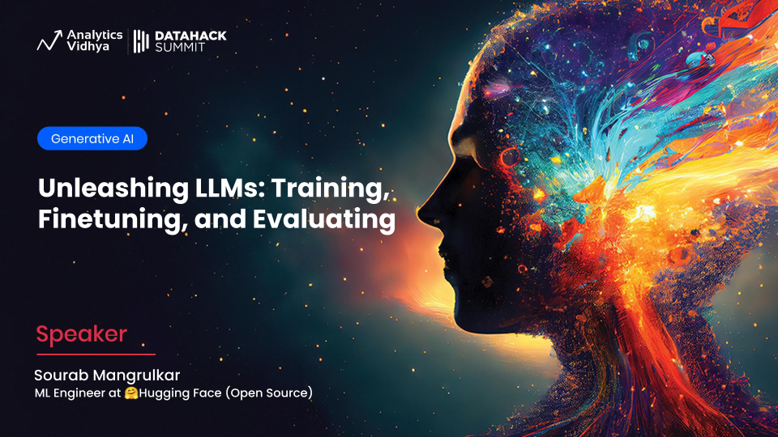

# Introduction

Generative artificial intelligence (AI) has made tremendous progress in recent years, pushing the boundaries of what was thought possible just a few decades ago. In this report, we will explore the current state of the art in generative AI, focusing on four key areas: natural language processing (NLP), computer vision, audio generation, and multimodal models. We will also discuss some of the challenges and limitations of these technologies, as well as their potential applications and future directions.

## NLP (ChatGPT)

Natural language processing (NLP) has seen significant advancements in recent years, thanks to the development of transformer-based models such as BERT and RoBERTa. These models have achieved state-of-the-art results in various NLP tasks, including text classification, sentiment analysis, machine translation, and question answering. One notable example of a generative NLP model is ChatGPT, which uses a variant of the transformer architecture to generate human-like text based on user input.

## Computer Vision (Mid-Journey)

In the field of computer vision, generative models have made impressive strides in image synthesis and editing. Models like Mid-Journey have demonstrated the ability to generate photorealistic images from text descriptions, while others have shown the capacity to edit existing images by changing objects, colors, and even entire scenes. While these models still face challenges in terms of accuracy and diversity, they hold great promise for applications such as graphic design, advertising, and virtual reality.

## Audio (Voicebox)

Generative audio models have also made significant progress, particularly in speech synthesis. Models like Voicebox have been able to produce high-quality voice samples that sound remarkably similar to real human voices. Other models have focused on generating music, achieving varying degrees of success depending on the complexity of the composition. As these models continue to improve, they could potentially revolutionize industries such as entertainment, education, and customer service.

## Video (Make-a-video)

The advent of video generation models represents another exciting frontier in generative AI. Models like Make-a-video have demonstrated the ability to create short videos based on text prompts, incorporating elements such as characters, backgrounds, and actions. While these models remain in their early stages, they raise intriguing possibilities for fields like filmmaking, animation, and marketing.

## Multimodal (GPT4, MUM)

Finally, researchers have begun exploring the intersection of multiple modalities, combining the strengths of each modality to create more sophisticated and expressive models. GPT4 and MUM represent two examples of multimodal models, capable of handling diverse inputs and outputs across different domains. These models pave the way for new applications that blur the lines between language, vision, and other sensory experiences.

With these developments in mind, let us proceed to examine each area in greater detail, highlighting both the achievements and the challenges faced by researchers in the field of generative AI.

By the way, I leveraged `Llama V2-70B` model to help me with the content for this workshop.

See it in action at [hf.co/chat](https://hf.co/chat/):

