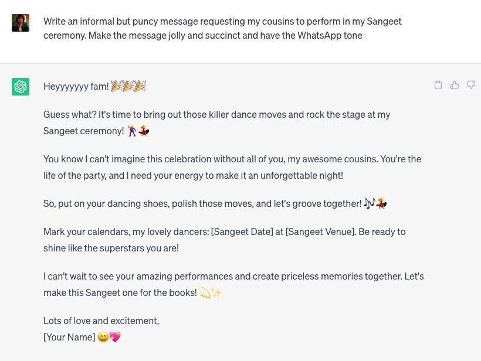

# Introduction

Generative artificial intelligence (AI) has made tremendous progress in recent years, pushing the boundaries of what was thought possible just a few decades ago. In this module, we will explore the current state of the art in generative AI, focusing on four key areas: natural language processing (NLP), computer vision, audio generation, and multimodal models. We will also discuss some of the challenges and limitations of these technologies, as well as their potential applications and future directions.

## Natural Language Processing (NLP)

Natural language processing (NLP) has seen significant advancements in recent years, thanks to the development of transformer-based models such as GPT, BERT and T5. These models have achieved state-of-the-art results in various NLP tasks, including text classification, sentiment analysis, machine translation, and question answering. One notable example of a generative NLP model is ChatGPT, which uses a variant of the transformer architecture to generate human-like text based on user input. 

Language Models trained on large amounts of data at the scale of trillions of tokens and having large amount of paramteres at the scale of tens to hundreds of billions of paramters are known as `Large Language Models (LLMs)`. They have shown great abilities in generating coherent texts, reasoning, following instructions, generating code and using various tools. Few of the most popular LLMs are GPT-4, ChatGPT, Codex, Llama, Flacon, Bloom, StarCoder, Codegen, GPTNeoX, OPT, Galactica, FlanT5, T5, BERT, RoBERTa, DeBERTa, E5 etc

In this workshop, we will be diving deep into LLMs. Below snippet shows a fun and real world example in text generation with ChatGPT. These LLM can be used for various usecases such as generating marketing copy from bullet point, converting the content into markdown format, explaining code snippets, creating emails from brief description, summarizing articles, question answering about your private data and a lot of other use cases that come to your mind.

Try it out at [chat.openai.com](https://chat.openai.com/)

Transformer based architecture are now foraying into other domains too. We will briefly look into the exciting applications in other modalities and the transformer models powering them below.

## Computer Vision (CV)

In the field of computer vision, generative models have made impressive strides in image synthesis and editing. Models like Dalle 2, Stable Diffusion, Imagen have demonstrated the ability to generate photorealistic images from text descriptions, while others such as ControlNet, InstructPix2Pix have shown the capacity to edit existing images by changing objects, colors, and even entire scenes. They hold great promise for applications such as graphic design, advertising, game development, filmmaking and virtual reality. These models use Attention mechanism of transformers as an important building block.

(Source [midjourney](https://www.midjourney.com/showcase/recent/))

## Audio

Recent advancements in audio technology have led to remarkable performances in various tasks, including Automatic Speech Recognition (ASR), Speech Identification (SID), Speech Translation (ST), Text-to-Speech (TTS), Voice Conversion (VC), and Speech Enhancement (SE). Some of the most popular models in this domain include Whisper, XLSR, SpeechT5, Voicebox, and Massively Multilingual Speech (MMS). These technologies have numerous applications, such as transcribing lectures, YouTube videos, and parliament sessions; creating a virtual avatar that speaks in your voice; real-time conversion from one language to another while preserving your style; and generating music from text. Overall, the advancements in audio technology have opened up new possibilities for improving communication, accessibility, and entertainment.

Below is an example of ASR using Whisper model from OpenAI hosted in 🤗 Spaces.

https://github.com/pacman100/DHS-LLM-Workshop/assets/13534540/e819d7d2-4d3d-412e-ae9c-7dda2059e840

Try it out! [Transcribe using Whisper](https://www.huggingface.co/spaces/openai/whisper) 

## Video

The advent of video generation models represents another exciting frontier in generative AI. Models like Make-a-video, CogVideo, Phenaki have demonstrated the ability to create short videos based on text prompts, incorporating elements such as characters, backgrounds, and actions. While these models remain in their early stages, they raise intriguing possibilities for fields like filmmaking, animation, and marketing.

Below is an example from the [Make-a-video](https://makeavideo.studio/) paper for the prompt: `A teddy bear painting a portrait`

(Source [Make-a-video](https://makeavideo.studio/). Prompt: A teddy bear painting a portrait)

## Multimodal

Finally, researchers have begun exploring the intersection of multiple modalities, combining the strengths of each modality to create more sophisticated and expressive models. Multimodal Models such as Meta-Transformer, GPT4, Flamingo, CLIP and MUM are capable of handling diverse inputs and outputs across different domains. These models pave the way for new applications that blur the lines between language, vision, and other sensory experiences. They have wide variety of applications such as visual question answering, 3D scene understanding, creating virtual avatars combining voics, facial characteristics and textual styles of a person and so on. 

(Source [Flamingo Paper](https://arxiv.org/pdf/2204.14198.pdf))

## What to expect from this workshop?
We will deep dive into the world of LLMs, right from the research papers to the latest trends with hands-on experience.

* Understanding the theory behind Transformer models and various popular architectures
* How to pre-train and evaluate LLMs?
* How to Prompt and Fine-Tune pre-trained LLMs?
* Understanding the challenges of Fully Fine-tuning LLMs
* How to Parameter-Efficient Fine-Tune LLMs?
* Leveraging LLMs via chains of thought and ReACT methodology, chaining multiple prompts and prompting it to use tools in an end-to-end application.

### Fun Fact

I leveraged `Llama V2-70B` model to help me with the content for this workshop.

See it in action at [hf.co/chat](https://hf.co/chat/):

https://github.com/pacman100/DHS-LLM-Workshop/assets/13534540/be64c6f6-632b-401c-bc17-88484abd612e

